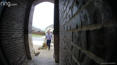

# RinGIF 

## Overview
 
RinGIF is a docker image that will automatically download Ring videos and convert them into GIFs 
These are useful for archiving, sharing, and for embedding in Home Assistant! 
 
## Requirements
- Ring doorbell or camera 
## Installation
 
# docker run -d --env email=myemailaddress@domain.com --env password=Password4MyRingAccount devinslick/ring_video_doorbell_gif

 
## Planned Features
- a web server inside the container for easier access 
- a variable to control the resolution of the gif 
- a variable to control the name of the video to save 
- a variable to control the name of the output gif 
 
## FAQ

* Where is my video/gif?*

- The latest video and gif will be kept on the docker volume mounted at /data. 
How am I supposed to get to the video/gif and share it? 
- You may want to consider sharing this volume with a web server.  You can also access it directly on your docker host. 
Why did you just add a webserver to this container? 
- See planned features above 
 
## Contributing
Please feel free to submit a pull request if you'd like to contribute to this code base! 
## Credits
This container would not be possible without the following awesome tools: 
https://github.com/tchellomello/python-ring-doorbell/ 
-Marcelo Moreira de Mello (tchellmello)'s python SDK. 
-This tool allows us to query Ring's site and download videos as they become available. 
https://github.com/FFmpeg/FFmpeg 
-This is the tool RinGIF uses to extract images from the video. 
https://github.com/ImageMagick/ImageMagick 
-RinGIF uses this to create GIF from the extracted images. 
